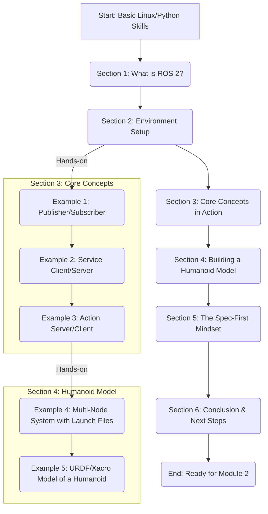

# Implementation Plan: Module 1 - The Robotic Nervous System (ROS 2)

## 1. Architecture Sketch

This chapter introduces foundational ROS 2 concepts and progressively builds towards a complete humanoid robot software stack. The architecture is a linear progression of complexity.

## 2. Detailed Section Structure

- **H1: Module 1 – The Robotic Nervous System (ROS 2)** (Word Count: 250)
  - Introduction to the "nervous system" analogy for robotics middleware.
  - Overview of the module's goals: from zero to a functional humanoid model.
- **H1: Section 1: Why ROS 2? The Foundation of Modern Robotics** (Word Count: 750)
  - H2: What is a Robot Operating System?
  - H2: From ROS 1 to ROS 2: A Necessary Evolution
    - *Figure 1: Diagram of ROS 1 Master vs. ROS 2 DDS Discovery.*
  - H2: Key Advantages: Real-Time, Security, and Scalability
- **H1: Section 2: Environment Setup: Your Digital Workshop** (Word Count: 1000)
  - H2: Prerequisites: Ubuntu 22.04 and Python Essentials
  - H2: Step-by-Step Installation of ROS 2 Humble Hawksbill
    - *Code Listing 1: Installation commands.*
    - *Table 1: Verification commands and expected output.*
  - H2: Creating and Building Your First ROS 2 Workspace
    - *Code Listing 2: `colcon build` process and output.*
- **H1: Section 3: Core Concepts: The ROS 2 Communication Patterns** (Word Count: 2000)
  - H2: Understanding Nodes: The Brain Cells of ROS 2
  - H2: Hands-On Example 1: Publisher & Subscriber (`rclpy`)
    - *Code Listing 3: `talker.py` and `listener.py`.*
  - H2: Hands-On Example 2: Services for Request/Reply
    - *Code Listing 4: Service server and client implementation.*
  - H2: Hands-On Example 3: Actions for Long-Running Tasks
    - *Code Listing 5: Action server and client for a mock joint movement.*
- **H1: Section 4: Assembling a Digital Humanoid** (Word Count: 2000)
  - H2: Describing Robots: The Role of URDF and Xacro
  - H2: Hands-On Example 4: A Multi-Node System with Launch Files
    - *Code Listing 6: A launch file to start multiple nodes.*
  - H2: Hands-On Example 5: Modeling a 12-DoF Humanoid with URDF/Xacro
    - *Code Listing 7: Snippets of Xacro macros for links and joints.*
  - H2: Visualizing Your Creation with RViz
    - *Figure 2: Screenshot of the final humanoid model in RViz.*
- **H1: Section 5: The Spec-First Mindset in Robotics** (Word Count: 500)
  - H2: Defining Interfaces Before Code: Custom Messages, Services, and Actions
    - *Code Listing 8: Creating `.msg`, `.srv`, and `.action` files.*
  - H2: The Payoff: Reproducibility and Safety
- **H1: Section 6: Conclusion** (Word Count: 250)
  - Recap of skills learned.
  - Bridge to Module 2: The Digital Twin.
- **H1: References**

*Total Estimated Word Count: 6750 words*

## 3. Research Approach

- **Strategy**: Write concurrently with research. Draft claims and concepts, using placeholders like `[Citation needed: ROS 2 real-time stats]`, and then find primary sources to validate and refine the text.
- **Source Shortlist (15 candidates)**:
  1. Macenski, S., et al. "Robot Operating System 2: Design, architecture, and uses in the wild." *Science Robotics*, 2022. (DOI: 10.1126/scirobotics.abm6074)
  2. Maruyama, Y., et al. "Exploring the performance of ROS2." *2016 IEEE/RSJ IROS*. (DOI: 10.1109/IROS.2016.7759612)
  3. Casini, D., et al. "On the real-time performance of ROS 2." *2019 IEEE/RSJ IROS*. (DOI: 10.1109/IROS40897.2019.8968523)
  4. "ROS 2 Humble Hawksbill" official documentation. (URL: https://docs.ros.org/en/humble/index.html)
  5. "URDF and Xacro" official ROS 2 documentation.
  6. Gerkey, B. "Why ROS 2?". ROSCon 2017 presentation.
  7. IEEE T-RO articles on ROS 2 based control systems.
  8. IJRR papers on middleware in robotics.
  9. Cho, Y., et al. "Real-Time Performance Analysis of Processing Chains on ROS 2 Executors." *IEEE RTAS*, 2021.
  10. López, B., et al. "A systematic review on the performance of ROS 2 communication mechanisms." *Sensors*, 2021.
  11. S. Wander, "ROS 2 security," ROSCon 2018.
  12. "The Robot Operating System (ROS) 2," *Communications of the ACM*, 2021.
  13. Estivill-Castro, V. "An introduction to robotics, algorithms and AI." *Springer*, 2020.
  14. Quigley, M., et al. "ROS: an open-source Robot Operating System." *ICRA 2009*.
  15. Thomas, D., et al. "A practical guide to robot operating system: The ros," *Springer*, 2021.

## 4. Quality Validation Plan

- **Readability**: Final draft to be processed through an online tool (e.g., Grammarly, Readable) to ensure Flesch-Kincaid grade level 10-12 and >75% active voice.
- **Plagiarism**: Final draft to be run through Grammarly's plagiarism checker.
- **Code Verification**: All 5+ code examples will be tested in a clean Docker container running Ubuntu 22.04 + ROS 2 Humble. Each code listing will have an associated verification script.
- **Fact-Checking**: All claims will be cross-referenced with the final citation list. DOIs will be checked for validity.

## 5. Decisions Needing Documentation

| Decision Category | Choice A | Choice B | Selected | Justification |
| :--- | :--- | :--- | :--- | :--- |
| **ROS 2 Version** | Humble Hawksbill | Iron Irwini | **Humble** | As an LTS (Long-Term Support) release, Humble provides stability and a longer support window, which is crucial for educational materials and reproducible research. It is the most mature LTS version currently recommended for new projects. |
| **Primary Language** | Python (rclpy) | C++ (rclcpp) | **Python** | The target audience has intermediate Python skills but not necessarily C++. `rclpy` is more approachable for beginners and sufficient for all concepts in this module. C++ can be introduced in later, more advanced modules. |

## 6. Testing & Acceptance Strategy

| Success Criterion | Verification Steps | Expected Output | Pass/Fail |
| :--- | :--- | :--- | :--- |
| **SC-001**: Install ROS 2 & create workspace | 1. Follow installation guide. 2. Run `ros2 launch demo_nodes_cpp talker` & `ros2 launch demo_nodes_py listener`. 3. Run `colcon build` in a new workspace. | 1. No errors. 2. Listener prints "Hello World" messages. 3. Build completes with `Finished <<< ...` | Pass / Fail |
| **SC-002**: 5+ examples run error-free | For each of the 5 examples: 1. `cd` to the package. 2. `colcon build`. 3. `ros2 launch <package_name> <launch_file>`. | Each launch completes and produces the output described in the chapter (e.g., messages passed, service responds, RViz shows model). | Pass / Fail |
| **SC-003**: Define custom interface | 1. Create a `custom_interfaces` package. 2. Define `MyMessage.msg`. 3. `colcon build`. 4. Use it in a Python node. | Build succeeds. Node can import and use `MyMessage`. | Pass / Fail |
| **SC-004**: Assemble & visualize humanoid model | 1. Launch the final URDF example launch file. | RViz opens and displays a 12-DoF humanoid model without errors. The robot state publisher is active. | Pass / Fail |
| **SC-005**: 80% claims backed by sources | 1. Count total technical claims. 2. Count claims with a citation. 3. (Cited Claims / Total Claims) >= 0.8. | The ratio is 80% or higher. All citations are in the final reference list. | Pass / Fail |
| **SC-006**: Readability scores met | 1. Run final text through Grammarly/Readable. | Flesch-Kincaid Grade Level is between 10-12. Active voice is >= 75%. | Pass / Fail |
| **SC-007**: Plagiarism check passed | 1. Run final text through Grammarly Plagiarism checker. | 0% similarity (excluding code, proper nouns, and citations). | Pass / Fail |

## 7. Phased Execution Plan (Deadline: Dec 11)

- **Phase 1 – Research & Foundation (Dec 9)**:
  - Finalize source list.
  - Draft Sections 1 & 2 (Intro, Environment Setup).
  - Write installation/verification scripts.
- **Phase 2 – Core Concepts & First 3 Examples (Dec 9)**:
  - Write Section 3.
  - Implement and test examples for Pub/Sub, Services, Actions.
- **Phase 3 – Advanced Examples & URDF Integration (Dec 10)**:
  - Write Section 4.
  - Implement multi-node launch file example.
  - Create and test the final 12-DoF URDF/Xacro model.
- **Phase 4 – Synthesis & Spec-First Discussion (Dec 10)**:
  - Write Section 5 & 6.
  - Create custom message example.
- **Phase 5 – Finalization (Dec 11)**:
  - Complete all writing and integrate citations.
  - Run all quality checks (Readability, Plagiarism).
  - Final review of all code and text for accuracy and clarity.
  - Submit for review.
