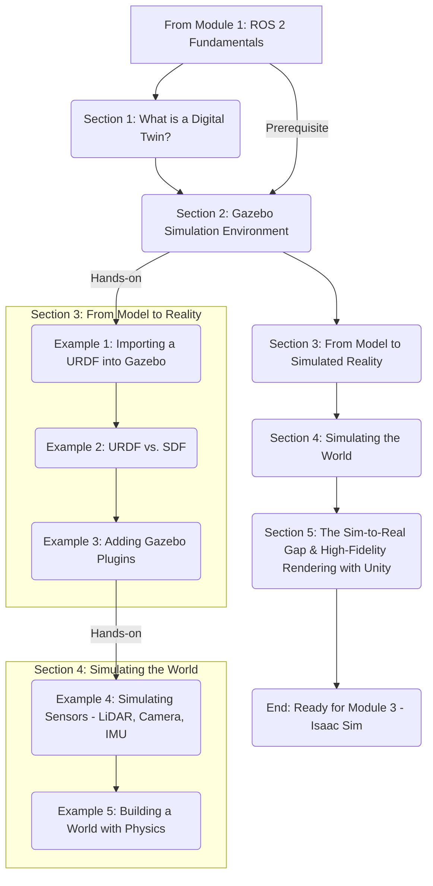

# Implementation Plan: Module 2 - The Digital Twin (Gazebo & Unity)

## 1. Architecture Sketch

This chapter builds directly on Module 1, taking the abstract ROS 2 concepts and giving them a physical (simulated) form. It establishes the foundation for all subsequent modules that require a robot to exist in an environment.

## 2. Detailed Section Structure

- **H1: Module 2 – The Digital Twin (Gazebo & Unity)** (Word Count: 250)
  - Introduction: Why simulation is non-negotiable in modern robotics.
  - Overview of the module's goals: from a simple URDF to a sensor-rich, physics-enabled digital twin.
- **H1: Section 1: The Power of Simulation** (Word Count: 750)
  - H2: What is a Digital Twin?
  - H2: The Economics and Safety of Simulation-First Development.
  - H2: The Spectrum of Simulators: From Physics Engines to High-Fidelity Renderers.
    - *Figure 1: Chart comparing simulators (Gazebo, Isaac Sim, Unity, Webots) on axes of Physics Accuracy vs. Photorealism.*
- **H1: Section 2: Your Simulator: Gazebo** (Word Count: 1000)
  - H2: Gazebo Classic vs. New Gazebo (Formerly Ignition): A Clear Recommendation.
  - H2: Installing Gazebo Garden and ROS 2 Integration.
    - *Code Listing 1: Installation commands for `ros-garden-gazebo-ros-pkgs`.*
  - H2: The Gazebo UI and Core Concepts (Worlds, Models, Plugins).
    - *Table 1: Key Gazebo command-line tools.*
- **H1: Section 3: Bringing Your Robot to Life** (Word Count: 2000)
  - H2: **Hands-On Example 1**: Importing the URDF from Module 1.
    - *Code Listing 2: Launch file to spawn a URDF model in Gazebo.*
  - H2: Beyond URDF: The Simulation Description Format (SDF).
  - H2: **Hands-On Example 2**: Converting a URDF to SDF.
    - *Code Listing 3: Gazebo tools for SDF conversion.*
  - H2: **Hands-On Example 3**: Adding Gazebo Plugins for Control.
    - *Code Listing 4: SDF snippet for a differential drive plugin.*
- **H1: Section 4: Simulating the Senses and the World** (Word Count: 2000)
  - H2: **Hands-On Example 4**: Simulating Sensors.
    - H3: The LiDAR Plugin.
      - *Code Listing 5: SDF for a LiDAR sensor + RViz2 visualization.*
    - H3: The Depth Camera Plugin.
      - *Code Listing 6: SDF for a depth camera + RViz2 visualization.*
    - H3: The IMU Plugin.
      - *Figure 2: Screenshot of RViz2 showing combined sensor outputs.*
  - H2: **Hands-On Example 5**: Building a World with Physics.
    - *Code Listing 7: A `.sdf` world file with ground plane, gravity, and simple shapes.*
- **H1: Section 5: Bridging to Reality** (Word Count: 750)
  - H2: The Sim-to-Real Gap: Why Your Simulation is a Lie.
    - *Table 2: Common sources of sim-to-real gap (dynamics, perception, etc.).*
  - H2: High-Fidelity Rendering: When to use Unity.
    - *Figure 3: Side-by-side comparison of a scene in Gazebo vs. Unity.*
- **H1: Section 6: Conclusion** (Word Count: 250)
  - Recap of simulation skills.
  - Bridge to Module 3, which uses the high-fidelity NVIDIA Isaac Sim.
- **H1: References**

*Total Estimated Word Count: 7000 words*

## 3. Research Approach

- **Strategy**: Same as Module 1: write concurrently with research, using placeholders and validating with primary sources.
- **Source Shortlist (15 candidates)**:
  1. Koenig, N., Howard, A. "Design and use of a 3D, open-source, multi-robot simulator." *IROS 2004*. (DOI: 10.1109/IROS.2004.1389372) - *Historical context for Gazebo*
  2. "Gazebo (Ignition) Documentation". (URL: https://gazebosim.org/)
  3. "Unity Robotics Hub Documentation". (URL: https://github.com/Unity-Technologies/Unity-Robotics-Hub)
  4. Muratore, F., et al. "A Survey on the Sim-to-Real Gap in Robotics." *IEEE T-RO*, 2022.
  5. Collins, J., et al. "A survey of domain randomization techniques for sim-to-real transfer." *IEEE Access*, 2021.
  6. SDF format specification. (URL: http://sdformat.org/spec)
  7. E. G. Cervera, et al. "A comparative study of physics simulators for robotics." *ICRA 2018*.
  8. A. Tan, et al. "Sim-to-real transfer for robotic manipulation: a survey." *IJRR*, 2023.
  9. "ROS 2 & Gazebo Integration" documentation.
  10. "ROS 2 & Unity Integration" documentation.
  11. IROS papers on "Digital Twin" in robotics.
  12. ICRA papers on "Simulation Fidelity".
  13. "PhysX SDK" documentation by NVIDIA.
  14. Papers comparing OGRE and modern rendering engines for simulation.
  15. Zhao, W., et al. "On the sim-to-real gap in deep reinforcement learning for robotics." *arXiv*, 2020.

## 4. Quality Validation Plan

- **Readability/Plagiarism**: Same as Module 1 (Grammarly checks).
- **Code Verification**: All 5 examples will be tested in a Docker container (Ubuntu 22.04 + ROS 2 Humble + Gazebo Garden). Each launch file will have a corresponding test file.
- **Fact-Checking**: Claims about simulator differences and sim-to-real will be rigorously checked against the sourced papers.

## 5. Decisions Needing Documentation

| Decision Category | Choice A | Choice B | Selected | Justification |
| :--- | :--- | :--- | :--- | :--- |
| **Primary Simulator** | Gazebo | Unity | **Gazebo** | Gazebo is the de-facto standard in the ROS community, is open-source, and provides a stronger focus on physics simulation over rendering, which is more critical for this introductory module. Unity is introduced as a specialized tool for high-fidelity graphics. |
| **Gazebo Version** | Gazebo Classic (11) | **Gazebo Garden** | **Gazebo Garden** | Gazebo Classic is EOL in early 2025. New educational material must use the modern, supported version. Garden is the latest release that has a corresponding ROS 2 integration package (`ros-garden-gazebo-ros-pkgs`). |
| **Unity Coverage** | In-depth Tutorial | Brief Comparison | **Brief Comparison** | A full Unity tutorial is outside the scope of this module. The goal is to make the reader aware of *why* and *when* they might choose Unity, paving the way for its use in later, more advanced topics. |

## 6. Testing & Acceptance Strategy

| Success Criterion | Verification Steps | Expected Output | Pass/Fail |
| :--- | :--- | :--- | :--- |
| **SC-001**: Install Gazebo & launch world | 1. Follow installation guide. 2. Run `gz sim empty.sdf`. 3. Launch example world with robot. | 1. No errors. 2. Gazebo GUI opens with an empty world. 3. Gazebo GUI opens with the specified world and humanoid model. | Pass / Fail |
| **SC-002**: 5+ examples run error-free | For each of the 5 examples: 1. `colcon build`. 2. `ros2 launch <package_name> <launch_file>`. | Each launch file executes without error, Gazebo loads, and the expected behavior occurs (e.g., robot appears, sensors publish data). | Pass / Fail |
| **SC-003**: Add new sensor | 1. Add a magnetometer plugin to the SDF. 2. `colcon build` & `ros2 launch`. 3. `ros2 topic echo /imu`. | The topic publishes `sensor_msgs/Imu` data that includes magnetic field readings. | Pass / Fail |
| **SC-004**: Compare Gazebo vs. Unity | 1. Read Section 5. 2. Answer conceptual questions, e.g., "When would you choose Unity over Gazebo for a perception task?" | The reader can articulate that Unity is preferred for photorealism-dependent tasks (e.g., training a vision model), while Gazebo is for general-purpose physics simulation. | Pass / Fail |
| **SC-005**: 80% claims backed by sources | 1. Count technical claims about simulation. 2. Count claims with citations. 3. (Cited / Total) >= 0.8. | The ratio is 80% or higher. | Pass / Fail |
| **SC-006**: Readability scores met | 1. Run final text through Grammarly/Readable. | Flesch-Kincaid Grade Level is 10-12. Active voice >= 75%. | Pass / Fail |
| **SC-007**: Plagiarism check passed | 1. Run final text through Grammarly Plagiarism checker. | 0% similarity (excluding code, proper nouns, citations). | Pass / Fail |

## 7. Phased Execution Plan (Deadline: Dec 12)

- **Phase 1 – Research & Foundation (Dec 10)**:
  - Finalize source list.
  - Draft Sections 1 & 2 (Intro, Gazebo Setup).
  - Write installation scripts and verify Gazebo/ROS 2 integration.
- **Phase 2 – Core Models & First 3 Examples (Dec 11)**:
  - Write Section 3.
  - Implement and test examples for URDF import, SDF conversion, and plugins.
- **Phase 3 – Advanced Simulation (Dec 11)**:
  - Write Section 4.
  - Implement sensor and physics world examples.
- **Phase 4 – Sim-to-Real & Unity (Dec 12)**:
  - Write Section 5 & 6.
  - Create comparison screenshots.
- **Phase 5 – Finalization (Dec 12)**:
  - Complete writing, integrate all citations.
  - Run all quality checks (Readability, Plagiarism).
  - Final review of all code, models, and text.
  - Submit for review.
